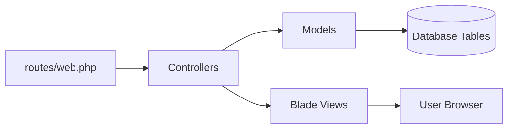
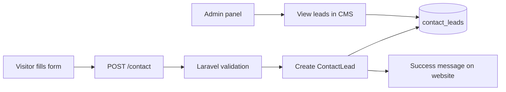
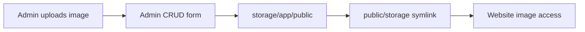

# GrowthForge Agency Laravel CMS Documentation

Ye project ek dynamic Laravel-based agency website hai jisme frontend website aur admin CMS dono included hain. Website Digital Marketing, Website Development, aur Content Writing agency ke liye banayi gayi hai.

## 1. Project Ka Main Goal

Owner/admin bina code edit kiye website ka content manage kar sake:

- Hero heading, subheading, CTA text
- About, mission, vision, footer text
- Services
- Pricing plans
- Combo packages
- Portfolio projects
- Process steps
- Testimonials
- FAQs
- Contact leads/inquiries
- Blog posts with SEO fields

## Public Pages

- `/` - Home
- `/about` - About Us
- `/services` - Services + pricing
- `/work` - Portfolio
- `/process` - How we work
- `/blog` - Blog listing
- `/blog/{slug}` - Dynamic blog detail
- `/contact` - Contact form
- `/privacy-policy` - Privacy Policy
- `/terms-and-conditions` - Terms & Conditions
- `/sitemap.xml` - Sitemap
- `/robots.txt` - Robots rules

## 2. Local Run Command

Terminal mein project folder par jaakar:

```powershell
cd D:\xampp\htdocs\agency
php artisan serve
```

Open:

```text
http://127.0.0.1:8000
```

Admin login:

```text
http://127.0.0.1:8000/login
Email: admin@example.com
Password: password
```

## 3. Technology Stack

- Backend: Laravel 12.x
- PHP: 8.2
- Frontend: Blade templates
- CSS: Tailwind CSS with Vite
- Database: SQLite locally, MySQL ready for production
- Authentication: Laravel session auth
- Uploads: Laravel public storage

Note: Laravel 13 PHP 8.3 require karta hai, is machine par PHP 8.2 hai, isliye latest compatible Laravel 12 install hua.

## 4. Website Flow Graph

```mermaid
flowchart TD
    Visitor[Website Visitor] --> Home[Frontend Home Page]
    Home --> ContactForm[Contact Form]
    ContactForm --> ContactLeadDB[(contact_leads table)]

    Admin[Admin User] --> Login[/login]
    Login --> Auth[Laravel Auth]
    Auth --> Dashboard[/admin Dashboard]

    Dashboard --> Settings[Website Content Settings]
    Dashboard --> Services[Services CRUD]
    Dashboard --> Pricing[Pricing Plans CRUD]
    Dashboard --> Combos[Combo Packages CRUD]
    Dashboard --> Portfolio[Portfolio CRUD + Images]
    Dashboard --> Process[Process Steps CRUD]
    Dashboard --> Testimonials[Testimonials CRUD + Images]
    Dashboard --> FAQs[FAQ CRUD]
    Dashboard --> Leads[Contact Leads View]

    Settings --> SiteSettingsDB[(site_settings)]
    Services --> ServicesDB[(services)]
    Pricing --> PricingDB[(pricing_plans)]
    Combos --> ComboDB[(combo_packages)]
    Portfolio --> PortfolioDB[(portfolio_projects)]
    Process --> ProcessDB[(process_steps)]
    Testimonials --> TestimonialsDB[(testimonials)]
    FAQs --> FaqDB[(faqs)]
    Leads --> ContactLeadDB

    SiteSettingsDB --> Home
    ServicesDB --> Home
    PricingDB --> Home
    ComboDB --> Home
    PortfolioDB --> Home
    ProcessDB --> Home
    TestimonialsDB --> Home
    FaqDB --> Home
```

## 5. MVC Architecture



### Important Files

- `routes/web.php`: Frontend, login, logout, and admin routes
- `app/Http/Controllers/HomeController.php`: Frontend homepage and contact form
- `app/Http/Controllers/AuthController.php`: Admin login/logout
- `app/Http/Controllers/Admin/DashboardController.php`: Admin dashboard stats
- `app/Http/Controllers/Admin/ResourceController.php`: CRUD logic for CMS modules
- `app/Http/Controllers/Admin/SettingsController.php`: Hero/about/footer/settings edit
- `config/cms.php`: CMS modules ki field definitions
- `resources/views/home.blade.php`: Main frontend website
- `resources/views/layouts/app.blade.php`: Frontend layout
- `resources/views/layouts/admin.blade.php`: Admin layout
- `resources/css/app.css`: Tailwind component classes
- `database/seeders/DatabaseSeeder.php`: Demo content and admin user

## 6. Database Tables Aur Connection

| Table | Kaam |
|---|---|
| `users` | Admin login user |
| `site_settings` | Hero, about, mission, vision, footer, meta content |
| `services` | Services section ke cards |
| `pricing_plans` | Pricing tables |
| `combo_packages` | Combo packages section |
| `portfolio_projects` | Portfolio projects and images |
| `process_steps` | Work process steps |
| `testimonials` | Client reviews |
| `faqs` | FAQ section |
| `contact_leads` | Contact form submissions |
| `blogs` | Blog posts, featured image, slug, and SEO metadata |

## Blog System

Admin path:

```text
http://127.0.0.1:8000/admin/blogs
```

Blog fields:

- Title
- Slug, auto generated from title if blank
- Short description
- Full content
- Featured image upload
- Meta title
- Meta description
- Meta keywords
- Published date
- Published status

SEO support:

- Dynamic meta title, description, and keywords
- Open Graph tags
- Clean URL structure: `/blog/post-slug`
- Sitemap: `/sitemap.xml`
- Robots: `/robots.txt`

## 7. Frontend Website Kaise Bana Hai

Frontend ka main file:

```text
resources/views/home.blade.php
```

Is page par data database se aa raha hai:

```php
HomeController@index()
```

Controller ye models se data fetch karta hai:

- `SiteSetting`
- `Service`
- `PricingPlan`
- `ComboPackage`
- `PortfolioProject`
- `ProcessStep`
- `Testimonial`
- `Faq`

Phir Blade file mein sections render hote hain:

- Hero section
- About section
- Services section
- Pricing section
- Combo packages
- Portfolio
- Process
- Testimonials
- FAQ
- Contact form
- Footer

## 8. Admin Panel Kaise Kaam Karta Hai

Admin URL:

```text
/admin
```

Admin routes `auth` middleware se protected hain. Agar user login nahi hai to `/login` par redirect hota hai.

Admin modules ka CRUD ek common controller se chalta hai:

```text
app/Http/Controllers/Admin/ResourceController.php
```

Kaunsa module kaunse fields use karega, ye define hai:

```text
config/cms.php
```

Example:

- Services ke fields: category, title, description, icon, sort order, active
- Pricing ke fields: category, name, price, description, features, highlighted
- Portfolio ke fields: title, category, description, image, live link

## 9. Contact Form Flow



Contact form fields:

- Name
- Email
- Phone
- Message

Data save hota hai:

```text
contact_leads table
```

## 10. Image Upload Flow

Portfolio aur testimonials mein image upload support diya gaya hai.



Storage link command:

```powershell
php artisan storage:link
```

## 11. Styling Kaise Bana Hai

Tailwind CSS use hua hai. Custom reusable classes yahan define hain:

```text
resources/css/app.css
```

Examples:

- `btn-primary`
- `btn-secondary`
- `panel`
- `pricing-card`
- `field`
- `field-dark`

Production CSS/JS build:

```powershell
npm run build
```

## 12. MySQL Production Setup

Local project SQLite se ready hai. Production/XAMPP MySQL use karne ke liye `.env` update karein:

```env
DB_CONNECTION=mysql
DB_HOST=127.0.0.1
DB_PORT=3306
DB_DATABASE=agency
DB_USERNAME=root
DB_PASSWORD=
```

Phir run karein:

```powershell
php artisan migrate --seed
php artisan storage:link
npm install
npm run build
```

## 13. Commands Cheat Sheet

```powershell
# Run project
php artisan serve

# Run migrations with demo content
php artisan migrate:fresh --seed

# Create public upload link
php artisan storage:link

# Install frontend packages
npm install

# Build CSS/JS
npm run build

# Run tests
php artisan test

# View routes
php artisan route:list
```

## 14. Summary

Is project mein ek complete dynamic agency website banayi gayi hai. Frontend public visitors ke liye high-converting layout show karta hai, aur backend admin ko CMS deta hai jahan se website ka almost sara content manage ho sakta hai.

Main connection simple hai:

```text
Admin CMS -> Database -> Frontend Website
Visitor Contact Form -> Database -> Admin Leads
```
